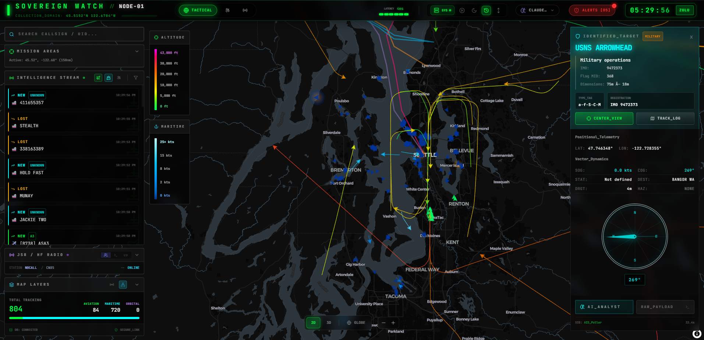
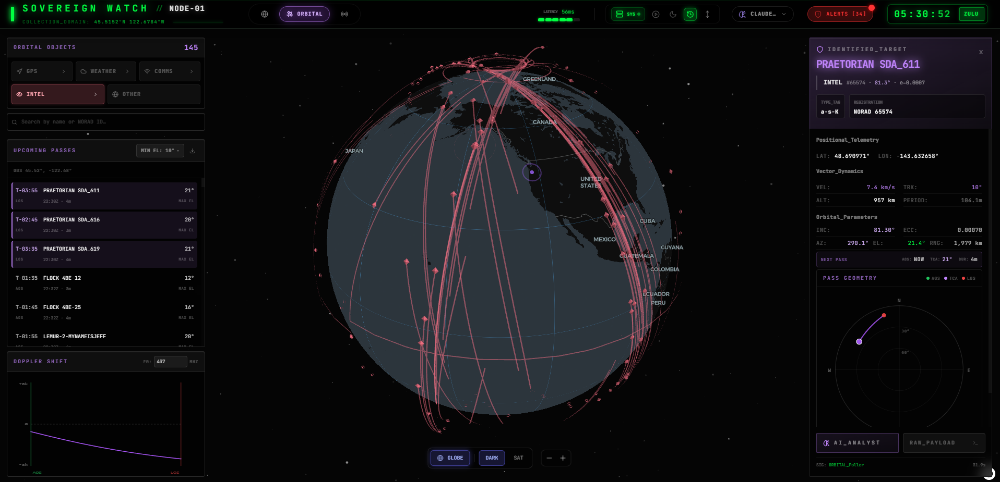
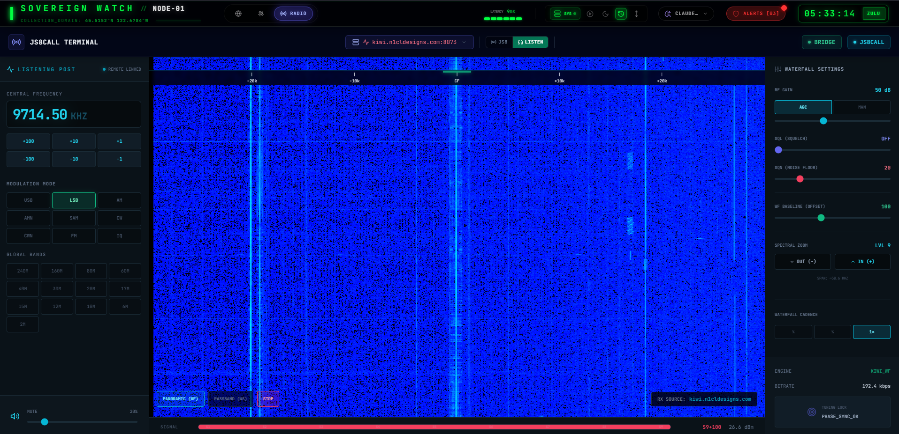
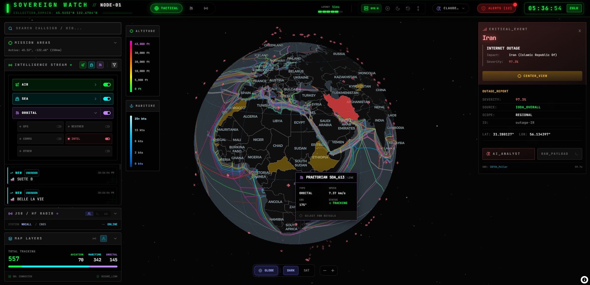
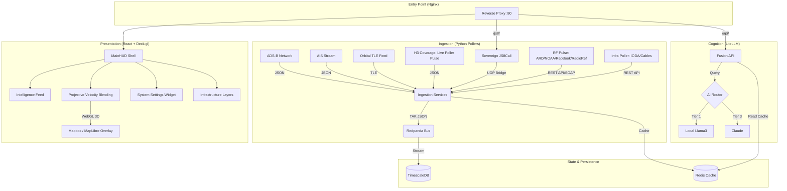

<div align="center">
  

# Sovereign Watch

### Distributed Multi-INT Fusion Center

  <p align="center">
    <a href="https://github.com/d3mocide/Sovereign_Watch/releases"></a>
    
    <a href="https://github.com/d3mocide/Sovereign_Watch/blob/main/LICENSE"></a>
    
  </p>

  <p align="center">
    <em>A self-hosted, edge-to-cloud intelligence platform for high-velocity telemetry (ADS-B, AIS, Orbital) and OSINT fusion.</em><br/>
    <em>It enforces data sovereignty by running on local hardware, utilizing a "Pulse" architecture and "Tiered AI" cognition.</em>
  </p>
</div>

---

## Screenshots

### Tactical Map View



### Orbital Tracking



### JS8CALL Terminal



### Global Map Filters and Layers



---

## Quick Start

```bash
# 1. Clone & configure
git clone https://github.com/d3mocide/Sovereign_Watch.git
cd Sovereign_Watch
cp .env.example .env
# Edit .env — see Documentation/Configuration.md for all variables

# 2. Boot
docker compose up -d --build

# 3. Access
#   Tactical Map: http://localhost
#   API Docs:     http://localhost/api/docs
```

**Minimum config required in `.env`:**

```bash
CENTER_LAT=45.5152        # Your monitoring area
CENTER_LON=-122.6784
AISSTREAM_API_KEY=...     # Free at aisstream.io (maritime data)
VITE_MAPBOX_TOKEN=...     # mapbox.com (optional — for 3D terrain)
ANTHROPIC_API_KEY=...     # For AI track analysis (optional)
```

---

## Documentation

Full documentation is in the [`Documentation/`](./Documentation/) folder:

| Guide                                                       | Description                              |
| :---------------------------------------------------------- | :--------------------------------------- |
| [Deployment & Upgrade Guide](./Documentation/Deployment.md) | Install, run, upgrade, troubleshoot      |
| [Configuration Reference](./Documentation/Configuration.md) | All `.env` variables                     |
| [ADS-B Poller](./Documentation/pollers/ADSB.md)             | Aviation data ingestion                  |
| [AIS Maritime Poller](./Documentation/pollers/AIS.md)       | Maritime data ingestion                  |
| [Orbital Pulse](./Documentation/pollers/Orbital.md)         | Satellite tracking                       |
| [Infra Poller](./Documentation/pollers/Infra.md)            | Internet outages + submarine cables      |
| [RF Pulse](./Documentation/pollers/RF.md)                   | RF repeaters + NOAA weather radio        |
| [TAK Protocol Reference](./Documentation/TAK_Protocol.md)   | Internal message schema (CoT/Protobuf)   |
| [API Reference](./Documentation/API_Reference.md)           | REST endpoints + WebSocket               |
| [UI User Guide](./Documentation/UI_Guide.md)                | How to use the Tactical and Orbital maps |

---

## Architecture



---

## Data Sources

All upstream data is sourced from **public, open-access networks**.

| Domain            | Source                                      | Update Rate              |
| :---------------- | :------------------------------------------ | :----------------------- |
| Aviation (ADS-B)  | adsb.fi, adsb.lol, airplanes.live           | Every 2–30 seconds       |
| Maritime (AIS)    | AISStream.io WebSocket                      | Event-driven (real time) |
| Orbital           | Celestrak TLE + SGP4 propagation            | Every 5 seconds          |
| Internet Outages  | IODA (Georgia Tech)                         | Every 30 minutes         |
| Submarine Cables  | TeleGeography                               | Every 24 hours           |
| RF Infrastructure | RepeaterBook, ARD, NOAA NWR, RadioReference | Every 6–168 hours        |

---

## ⚠️ Disclaimer

> [!IMPORTANT]
> Sovereign Watch ingests telemetry and intelligence from public, open-source networks (e.g., ADS-B, AIS, public API feeds). All data is strictly derivative of these unencrypted, publicly broadcasted signals.

> [!WARNING]
> **All data is provided "AS IS" without any warranty of accuracy, reliability, or completeness.** The developers assume no responsibility for decisions taken based on the intelligence presented. Sovereign Watch is designed purely for research, educational, and hobbyist data fusion purposes.

---

## AI Agent Protocol

This repository is **Agent-Aware**. Read `AGENTS.md` before contributing.

- All inter-service data must adhere to the **TAK Protocol** — see [TAK Protocol Reference](./Documentation/TAK_Protocol.md)
- Follow the "Sovereign Glass" design principles for all UI modifications
- Never run commands directly on the host — use Docker Compose

---

## Contributing

Pull requests are welcome. Please review `AGENTS.md` and the [Documentation](./Documentation/) before contributing.

- **Issues:** Use the GitHub issue tracker for bugs and feature requests
- **PRs:** Include a clear description; AI agent contributions must align with `AGENTS.md`

---

## Tech Stack

[Docker](https://www.docker.com/) · [FastAPI](https://fastapi.tiangolo.com/) · [React](https://react.dev/) · [Deck.gl](https://deck.gl/) · [MapLibre GL JS](https://maplibre.org/) · [Mapbox GL JS](https://www.mapbox.com/) · [TimescaleDB](https://www.timescale.com/) · [Redpanda](https://redpanda.com/) · [Celestrak](https://celestrak.org/) · [JS8Call](http://js8call.com/) · [KiwiSDR](http://kiwisdr.com/)

---

<div align="center">
  <p>
    <b>Sovereign Watch</b> &copy; 2026<br/>
    <i>Maintained by d3FRAG Networks & The Antigravity Agent Team.</i><br/><br/>
    <a href="#sovereign-watch">Back to Top</a>
  </p>
</div>
